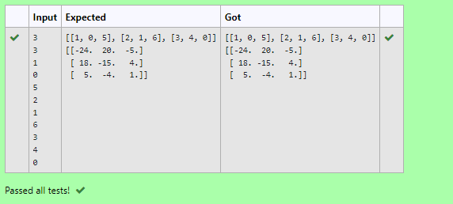

# Inverse-of-matrix
## AIM:
Write a python program to find the inverse of a nested array.

## ALGORITHM:
### Step 1:
Import numpy library using import statement.
### Step 2:
Create an empty list and prompt the user to provide number of rows and colums for the nested array using int() method.
### Step 3:
Initiate a nested for loop and an empty temprary list to get and append elements from the user and store it in a nested array form.
### Step 4:
Display the original nested array.
### Step 5:
Find the inverse of the array using linalg.inv() method and display the result.

## PROGRAM:
```
'''
Program to find the inverse of a nested array
Developed by: Vishranthi.A
RegisterNumber: 21003066
'''
import numpy as np
l1, l2 = [],[]
r,c= int(input()),int(input())
for i in range(r):
    for j in range(c):
        num=int(input())
        l1.append(num)
    l2.append(l1)
    l1=[]
print(l2)
value1= np.array(l2)
inverse = np.linalg.inv(value1)
print(inverse)
```

## OUTPUT:

## RESULT:
Thus the python program to find the inverse of a nested array is successfully executed.